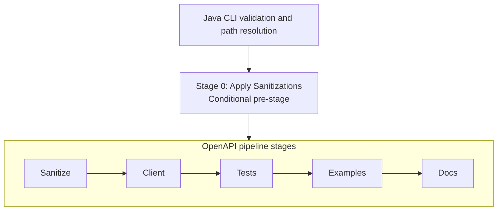

# OpenAPI Workflow Reference

This reference indexes the stages that implement the `bal connector openapi` workflow. It is intended for maintainers
and AI coding agents tracing the OpenAPI control flow, diagnosing connector generation or regeneration, and changing
stages without breaking the contracts between the Java CLI and the Ballerina automator.

This reference is specific to the OpenAPI flow. It does not describe the separate `bal connector sdk` workflow or its
Java SDK analysis and connector-generation stages.

## Workflow overview

```bash
bal connector openapi -i <openapi-spec> -o <output-dir>
```

The Java CLI validates and resolves the arguments, then calls the Ballerina `runOpenApiGenerationWorkflow` function.
The function runs a conditional pre-stage followed by five user-visible pipeline stages.



## Stage index

| Stage | Workflow key | Responsibility |
|---|---|---|
| [0 — Apply Sanitizations](openapi-workflow/stage-0-apply-sanitizations.md) | Part of `sanitize` | Replay recorded connector-specific changes against an incoming OpenAPI spec |
| [1 — Sanitize OpenAPI Specification](openapi-workflow/stage-1-sanitize-openapi-specification.md) | `sanitize` | Flatten and align the spec, improve descriptions, summaries, operation IDs, and schema names, and refresh `sanitations.md` |
| [2 — Generate and Validate Client](openapi-workflow/stage-2-generate-and-validate-client.md) | `client` | Generate the Ballerina client, build it, and attempt compilation-error recovery |
| [3 — Generate Tests](openapi-workflow/stage-3-generate-tests.md) | `tests` | Generate the mock service and connector tests from the sanitized specification |
| [4 — Generate Examples](openapi-workflow/stage-4-generate-examples.md) | `examples` | Generate AI-assisted Ballerina usage examples |
| [5 — Generate Documentation](openapi-workflow/stage-5-generate-documentation.md) | `docs` | Generate connector, test, and example documentation |

Stage 0 is coupled to `sanitize`: `-x sanitize` skips both sanitation replay and Stage 1. It cannot be selected or
excluded independently. The other five workflow keys can be excluded individually with `-x/--exclude`.
