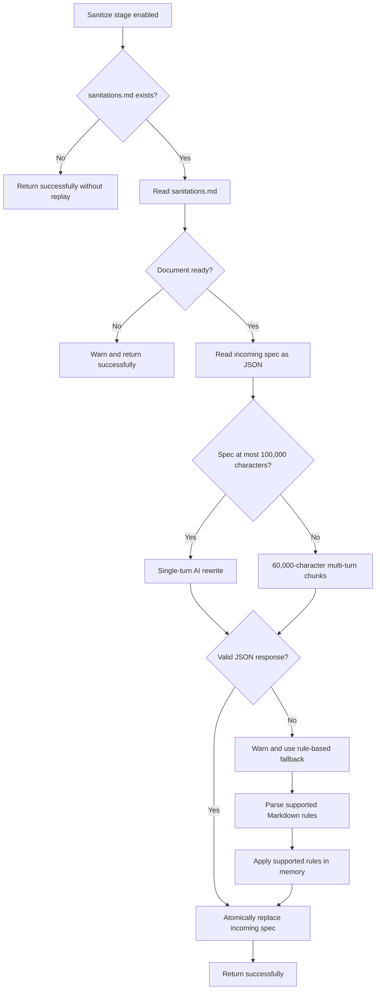

# Stage 0: Apply Sanitizations (Pre-stage)

[← OpenAPI workflow index](../openapi-workflow-reference.md) · [Next: Stage 1 →](stage-1-sanitize-openapi-specification.md)

The source labels sanitization itself as Stage 1. “Stage 0” is the reference name for the sanitation-replay logic at
the beginning of that stage; it is not a separate CLI stage and cannot be selected or excluded independently.

## Fresh generation and regeneration

Fresh generation and regeneration use the same command and workflow function. They differ only in the artifacts
already present in the resolved specification directory.

| Run type | `sanitations.md` state | Stage 0 behavior |
|---|---|---|
| Fresh generation | Does not exist | Skip replay and continue to sanitization |
| Regeneration | Exists and is ready | Replay its rules against the incoming spec |
| Regeneration with a draft document | Contains placeholders or template content | Warn, skip replay, and continue |
| Sanitize excluded | Not inspected | Stage 0 does not run |

The workflow treats `sanitize`, `client`, `tests`, `examples`, and `docs` as its selectable stages. The
`-x sanitize` option skips both Stage 0 and the sanitize stage. In that mode, CLI preflight requires an existing
`aligned_ballerina_openapi.json` in the specification directory, and the input spec is not required.

## Relevant source

- [`openapi_workflow.bal`](../../connector-core/connector-automator/openapi_workflow.bal) orchestrates Stage 0 and the
  five selectable stages.
- [`sanitations_handler.bal`](../../connector-core/connector-automator/modules/sanitizor/sanitations_handler.bal)
  implements sanitation-document validation, replay, fallback parsing, atomic writes, and document generation.
- [`OpenApiAutomatorWorkflow.java`](../../connector-cli/src/main/java/io/ballerina/connectortool/workflows/OpenApiAutomatorWorkflow.java)
  implements CLI option handling and passes the resolved paths into the Ballerina workflow.

## Purpose

Sanitization makes connector-specific changes to an upstream OpenAPI document. When the upstream publisher releases
a new version of that document, blindly sanitizing it again can lose decisions made during an earlier generation.
Stage 0 preserves those decisions by applying the existing `sanitations.md` to the newly supplied spec before the
normal flatten, align, and AI-enhancement work begins.

The pre-stage calls:

```ballerina
sanitizor:applySanitations(sanitationsPath, openApiSpec)
```

It is attempted only inside the `sanitize` branch. A replay error is deliberately non-fatal at the workflow level:
the orchestrator logs a warning and passes the input to the normal sanitizer.

## Contract

| Property | Contract |
|---|---|
| Trigger | The `sanitize` stage is not excluded |
| Sanitation document | `<spec-dir>/sanitations.md` |
| Incoming spec | The resolved `-i/--input` path |
| Primary effect | The incoming spec file is rewritten in place |
| Separate output | None |
| Consumer | The sanitize stage reads the same incoming path immediately afterward |
| Missing document | Successful no-op |
| Incomplete document | Warning followed by a successful no-op |
| Replay error | Returned to the orchestrator, which warns and continues |

The function itself returns errors for file access, parsing, and atomic replacement failures. The non-fatal policy
belongs to `runOpenApiGenerationWorkflow`, not to the public `applySanitations` function. A direct caller must decide
how to handle the returned error.

## Control flow



At the workflow boundary, any error escaping this flow is converted to a warning:

```text
could not apply recorded sanitations — continuing: <reason>
```

The sanitize stage then runs regardless. This favors producing a connector from the latest upstream contract over
aborting regeneration solely because historical decisions could not be replayed.

## 1. Locate the sanitation document

The orchestrator derives the path by appending `sanitations.md` to the specification directory supplied by the Java
layer. If the file does not exist, `applySanitations` logs the following message at verbose level and returns without
initializing the AI service or reading the incoming spec:

```text
no sanitations.md found — skipping pre-sanitization step
```

The Java resolver normalizes `--spec-dir` to a directory ending in `docs/spec`. If the supplied value already ends
in `docs/spec`, it is used directly; otherwise, `docs/spec` is appended.

## 2. Initialize AI and validate the document

When `sanitations.md` exists, `applySanitations` initializes or reuses the shared Anthropic model provider. An
initialization error is logged and does not immediately end replay because the rule-based fallback may still handle
the document.

When AI is available, `isSanitationsDocReady` asks the model whether the Markdown is a complete document containing
real changes and no TODOs, placeholders, or empty template sections.

- A response beginning with `true`, ignoring case and surrounding whitespace, permits replay.
- Any other successful response skips replay.
- A validation-call error fails open: the function assumes the document is ready and continues.
- When AI is unavailable, readiness validation also defaults to ready so the fallback parser can run.

This check prevents a generated or hand-written draft from being treated as executable regeneration policy.

## 3. Load the incoming specification

After the readiness check, Stage 0 loads the incoming spec into a JSON value and serializes it to a compact JSON
string for the AI path. The root is expected to be an OpenAPI JSON object, consistent with the CLI’s earlier semantic
validation of the `openapi` or `swagger` field and the `paths` object.

Loading happens before the AI/fallback branch because both paths operate on the same JSON representation.

## 4. Apply the AI rewrite

The AI path sends the complete sanitation document and OpenAPI JSON to the model. Its prompt recognizes these common
change types:

- server URL changes;
- path-prefix removal;
- recursive format changes;
- schema-property nullability changes; and
- schema-property type changes.

The prompt explicitly excludes:

- Ballerina code constructs such as generated record fields or `int:signed32`;
- summary and description enhancements, which the sanitize stage handles separately; and
- the OpenAPI CLI command included in the sanitation document footer.

For a serialized spec of at most 100,000 characters, the function performs a single request and expects only the
rewritten JSON document.

For a larger spec, it starts a multi-turn conversation:

1. Send the sanitation document and announce the number of spec parts.
2. Split the serialized spec into 60,000-character chunks.
3. Send each chunk in order and retain every assistant acknowledgment in the conversation history.
4. Ask the model to return the complete rewritten spec after the final chunk.

The chunking is based on Ballerina string character indexes, not tokens or JSON boundaries. The model must reconstruct
the full document from the conversation.

Before accepting the result, `parseModifiedSpec` trims whitespace, tolerates a surrounding Markdown code fence, and
parses the remaining content as JSON. Invalid JSON changes the execution path to the rule-based fallback; it is not
written to disk.

## 5. Apply the rule-based fallback

Fallback runs when the AI service is unavailable or the AI rewrite returns an error or invalid JSON. It parses
numbered sections from `sanitations.md` into typed rules and applies the recognized subset mechanically.

### Required Markdown shape

Each fallback rule must begin with a numbered section such as `1.`, `2.`, or `12.`. The parser collects content until
the next numbered section and classifies the block from keywords in its heading. Values normally appear on
`- **Original**:` and `- **Updated**:` lines and may be inline or on the next non-empty line.

Example:

```markdown
1. Change the `url` property of the servers object
- **Original**: `https://api.example.com`
- **Updated**: `https://api.example.com/v1`
- **Reason**: Move the common version prefix into the base URL.

2. Update the API Paths
- **Original**: Paths included common prefix `/v1` in each endpoint.
- **Updated**: Common prefix removed from endpoints.
- **Reason**: Avoid duplicating the prefix in every generated resource path.

3. Update `date-time` to `datetime`
- **Original**: `"format":"date-time"`
- **Updated**: `"format":"datetime"`
- **Reason**: Match the format expected by connector generation.

4. Change `Event occurredAt` to nullable
- **Original**: The `occurredAt` field in `Event` was not nullable.
- **Updated**: The `occurredAt` field is nullable.
- **Reason**: The service omits the value for pending events.

5. Change `Event.sequence` from `string` to `integer`
- **Original**: The `sequence` field was defined as a `string`.
- **Updated**: The `sequence` field has been changed to `integer`.
- **Reason**: The service returns a numeric sequence.
```

Hand-written content should retain this structure if it must work without AI. Natural-language sections outside this
shape may be understood by the AI path but ignored by the fallback.

### Supported fallback behavior

| Rule | Matching and mutation behavior |
|---|---|
| Server URL | Replaces a `servers[*].url` only when it exactly equals the recorded original URL |
| Path prefix | Rebuilds the `paths` map and strips the recorded prefix from every matching path key |
| Format | Recursively replaces every exact string value stored under a `format` key |
| Nullability | Sets `nullable` on a direct property of the named component schema |
| Type | Changes a direct property’s `type` only when its current value equals the recorded original type |

For nullability and type rules without a parsed schema name, the fallback checks every schema for a matching direct
property. Schema lookup is limited to `components.schemas`, and property lookup does not recursively traverse nested
inline schemas.

Unknown numbered sections are collected in `rawEntries`, but `applyRulesToSpec` does not execute them. Reasons are
parsed for context and logging but do not affect matching.

Path-prefix removal deserves extra care. If two original path keys collapse to the same key after prefix removal, the
later assignment replaces the earlier value in the rebuilt map. The implementation does not report a collision.

## 6. Replace the input atomically

Both successful paths use the same atomic JSON writer:

1. Prettify the in-memory JSON.
2. Write `<input>.tmp`.
3. If the input exists, remove a stale `<input>.bak` and rename the input to `<input>.bak`.
4. Rename the temporary file to the original input path.
5. Remove the backup after success.

If the final rename fails, the function attempts to remove the temporary file and restore the backup. Cleanup and
restoration are best-effort operations. A successful replay therefore leaves only the rewritten input; `.tmp` and
`.bak` are transient implementation artifacts rather than retained backups.

The writer always emits prettified JSON, regardless of the input’s prior formatting.

## Examples

### Fresh generation

Given a new output/specification directory without `sanitations.md`:

```bash
bal connector openapi -i ./openapi.json -o ./connector
```

Stage 0 performs no write. The sanitize stage produces the aligned spec and later creates `sanitations.md` for future
runs.

### Regeneration

Given a ready sanitation document in the resolved specification directory:

```bash
bal connector openapi -i ./openapi-v2.json -o ./connector -v
```

A successful AI replay logs:

```text
applying sanitations via AI
spec size: <n> chars
single-pass AI rewrite
✓ sanitations applied (AI-powered)
```

For a large spec, `single-pass AI rewrite` is replaced by messages reporting the number of chunks and each chunk sent.

If the rewrite fails and fallback succeeds, verbose output includes the parsed rule counts and ends with:

```text
✓ sanitations applied (rule-based)
```

### Before and after

For the sanitation entries shown earlier, a fragment such as:

```json
{
  "servers": [{"url": "https://api.example.com"}],
  "paths": {"/v1/events": {}},
  "components": {
    "schemas": {
      "Event": {
        "type": "object",
        "properties": {
          "occurredAt": {"type": "string", "format": "date-time"},
          "sequence": {"type": "string"}
        }
      }
    }
  }
}
```

becomes:

```json
{
  "servers": [{"url": "https://api.example.com/v1"}],
  "paths": {"/events": {}},
  "components": {
    "schemas": {
      "Event": {
        "type": "object",
        "properties": {
          "occurredAt": {"type": "string", "format": "datetime", "nullable": true},
          "sequence": {"type": "integer"}
        }
      }
    }
  }
}
```

### Excluding sanitization

The following command does not run Stage 0:

```bash
bal connector openapi -o ./connector -x sanitize
```

The CLI requires the resolved spec directory to already contain `aligned_ballerina_openapi.json`. Later stages consume
that artifact, and the raw input spec is neither required nor changed.

## Handoff to the sanitize stage

After Stage 0 returns, the sanitize stage receives the same `openApiSpec` path. Its main steps are:

1. Flatten the input with `bal openapi flatten`.
2. Align the flattened document with `bal openapi align`.
3. Convert aligned YAML output to JSON when applicable.
4. Add missing descriptions.
5. Improve summaries and operation IDs.
6. Improve schema names while reusing stable mappings.

On completion, the canonical downstream artifact is:

```text
<spec-dir>/aligned_ballerina_openapi.json
```

The workflow then calls `generateSanitationsDoc` with the current input and aligned output. If no document exists, it
creates one from auto-detected differences. If one exists, it preserves non-empty human-authored numbered sections,
replaces stale auto-generated sections with current detections, filters auto-generated sections already covered by
human content, renumbers the result, updates the date, and rebuilds the CLI-command footer.

Failure to refresh `sanitations.md` is also non-fatal. It is reported as:

```text
could not refresh sanitations.md: <reason>
```

## Troubleshooting

| Symptom | Meaning | Maintainer or agent action |
|---|---|---|
| No replay-related normal output | Most Stage 0 detail is verbose-only | Re-run with `-v` |
| `no sanitations.md found` | The resolved spec directory has no replay policy | Confirm `--spec-dir` resolution and whether this is a fresh run |
| `appears incomplete or contains template content` | AI readiness validation rejected the document | Complete/remove TODOs and placeholders, then rerun |
| `AI rewrite failed ... falling back` | The call failed or returned invalid JSON | Inspect provider errors and verify the Markdown fallback shape |
| Rule counts are all zero | No numbered blocks matched supported fallback headings | Use the documented numbered format or rely on a valid AI rewrite |
| Replay reports success but a field is unchanged | An exact URL/type match or schema/property lookup did not match | Compare the new upstream spec with recorded original values |
| `could not apply recorded sanitations — continuing` | An error escaped `applySanitations` | Inspect the nested message; sanitization continued without guaranteed replay |
| Unexpected `.tmp` or `.bak` remains | Atomic replacement or cleanup was interrupted | Preserve the files and determine which contains the valid complete JSON before recovery |

## Implementation appendix: current limitations

This section records behavior maintainers and AI agents must account for in the current implementation. It describes
the code as it exists; it is not a statement of the desired long-term contract.

### Replay reads JSON only

CLI validation accepts `.json`, `.yaml`, and `.yml`, but `applySanitations` currently loads the incoming path with
`io:fileReadJson`. Consequently, Stage 0 cannot replay a sanitation document against YAML input. The error is caught
by the orchestrator, logged as a warning, and the normal sanitizer continues; YAML flattening/alignment may still
succeed, but the recorded changes were not replayed.

Until the reader is made format-aware, use a JSON input for regeneration when sanitation replay is required.

### The input is mutated in place

Stage 0 does not create a separate “replayed” spec. Successful replay replaces the file supplied through `-i`. This is
easy to miss when the path points at a checked-in upstream document or a downloaded source intended to remain
pristine.

Use a disposable copy as the CLI input when the original must be preserved. The transient `.bak` is deleted after a
successful write and is not a recovery copy.

### Generated documents contain readiness placeholders

A newly generated `sanitations.md` includes TODO placeholders for the author and source link. The readiness prompt
explicitly rejects documents containing TODOs or unfilled template text. With AI validation available, a generated
document therefore remains non-executable until a maintainer or agent completes or removes those placeholders.

Document refresh preserves this header content, so maintainers and agents should not expect a later run to remove
the TODOs automatically.

### Default spec-directory wording and behavior differ

Current CLI help describes the default as `<output-dir>/docs/spec`. The Java resolver actually starts from the process
working directory when `--spec-dir` is omitted, producing `<cwd>/docs/spec`. A non-default `-o` can therefore place the
connector and its specification artifacts under different roots.

Pass `--spec-dir <output-dir>` when location must be unambiguous. The resolver appends `docs/spec` unless the supplied
path already ends with those components.

### CLI fallback availability is constrained by global AI initialization

The Java command rejects a missing `ANTHROPIC_API_KEY`, and `runOpenApiGenerationWorkflow` initializes the AI service
before entering Stage 0. If that top-level initialization fails, the workflow returns before `applySanitations` can
select its no-AI fallback. In the normal CLI path, fallback is therefore most relevant when an already initialized
provider later fails during readiness or rewrite, not when credentials are absent.

Direct callers of `applySanitations` can reach the no-AI fallback because that function treats its own initialization
failure as non-fatal.

### The fallback is intentionally narrower than the AI path

The AI can interpret arbitrary completed natural-language entries, while the fallback executes only five typed rule
families. `rawEntries` are not applied. A sanitation document that succeeds with AI may therefore produce only a
partial replay during fallback unless it follows the supported structure.

When adding a new sanitation category, maintainers and AI agents should update all of the following together:

1. The AI application prompt.
2. The fallback rule type and Markdown classifier/parser.
3. The programmatic mutation logic.
4. Sanitation-document generation and merge detection.
5. This reference’s rule table and examples.
