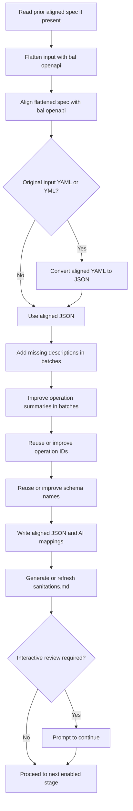

# Stage 1: Sanitize OpenAPI Specification

[← Stage 0](stage-0-apply-sanitizations.md) · [OpenAPI workflow index](../openapi-workflow-reference.md) · [Next: Stage 2 →](stage-2-generate-and-validate-client.md)

## Purpose

Stage 1 converts the incoming OpenAPI contract into the stable JSON contract consumed by every downstream stage. It
flattens external references, aligns the API with Ballerina conventions, enriches incomplete metadata, preserves
operation and schema naming decisions across regeneration, and refreshes the sanitation record.

Stage 0 runs at the beginning of the same `sanitize` branch. Stage 1 therefore reads the input path after any recorded
sanitizations have been applied.

## Relevant source

- [`openapi_workflow.bal`](../../connector-core/connector-automator/openapi_workflow.bal) owns stage orchestration,
  failure propagation, sanitation-document refresh, and interactive review.
- [`execute.bal`](../../connector-core/connector-automator/modules/sanitizor/execute.bal) implements the six sanitation
  steps.
- [`batch_processor.bal`](../../connector-core/connector-automator/modules/sanitizor/batch_processor.bal) and
  [`schema_names.bal`](../../connector-core/connector-automator/modules/sanitizor/schema_names.bal) implement the
  batched AI enhancements and stable mappings.

## Contract

| Property | Contract |
|---|---|
| Workflow key | `sanitize` |
| Input | OpenAPI JSON, YAML, or YML path supplied with `-i/--input` |
| Output directory | Resolved `<spec-dir>` ending in `docs/spec` |
| Canonical output | `<spec-dir>/aligned_ballerina_openapi.json` |
| Supporting artifacts | Flattened/aligned intermediate specs, `ai-mappings.json`, and `sanitations.md` |
| Downstream consumers | Client, tests, and Stage 0 of a future regeneration run |
| Critical failures | Output-directory, YAML conversion, schema-name improvement, and core file errors |
| Partial failures | Description, summary, and operation-ID enhancement failures are warnings |
| Interactive target | `aligned_ballerina_openapi.json` when another enabled stage follows |

## Control flow



## 1. Preserve prior operation IDs

If `<spec-dir>/aligned_ballerina_openapi.json` already exists, the sanitizer builds a map from path and HTTP method to
the previous `operationId`. Matching operations in the new contract reuse those IDs. Only operations not covered by
the prior map are sent for AI improvement.

An unreadable previous aligned spec does not abort this preliminary lookup; the sanitizer proceeds without a reusable
map. A valid previous spec with no operation IDs also results in full AI review.

## 2. Flatten and align the contract

The stage creates the specification directory recursively and invokes:

```bash
bal openapi flatten -i <input-spec> -o <spec-dir>
bal openapi align -i <flattened-spec> -o <spec-dir>
```

The flattened filename follows the input extension: `flattened_openapi.json`, `flattened_openapi.yaml`, or
`flattened_openapi.yml`. Alignment produces `aligned_ballerina_openapi` in the corresponding format.

Both command failures are logged as warnings rather than returned immediately. Processing continues, so a missing or
invalid intermediate file normally surfaces in a later read or conversion step with more specific context.

## 3. Normalize the aligned output to JSON

JSON inputs already produce the canonical JSON artifact. For YAML/YML inputs, conversion tries these mechanisms in
order:

1. Ballerina's YAML parser.
2. `yq -o=json` when the Ballerina parser rejects the document.
3. Python with PyYAML when `yq` is absent, fails, or returns invalid JSON.

The resulting JSON is prettified and written atomically to `aligned_ballerina_openapi.json`. If every conversion path
fails, Stage 1 returns an error and the workflow stops.

## 4. Enrich descriptions and summaries

Missing schema, field, parameter, operation, and response descriptions are collected and processed in batches of 20.
Operation summaries are improved afterward so they can use the new descriptions as context. Batch calls use retry
configuration with exponential backoff and optional jitter.

Successful batches are applied even if other batches fail. When all batches for an enhancement fail, that enhancement
returns an error; `executeSanitizor` logs it and continues to the next enhancement. Partial results are therefore valid
Stage 1 output and are reported in verbose logs.

## 5. Stabilize operation IDs

The operation-ID pass first restores prior IDs for matching path/method pairs. It then batches remaining operations,
reserves existing IDs, and suffixes AI-proposed collisions until they are unique within the processed set. A final
guard logs duplicate IDs that still exist in the specification.

Operation-ID batch failure is non-fatal to the overall sanitizer. Prior IDs and successful AI batches remain applied.

## 6. Stabilize schema names

Schema decisions are stored under `schemaNames` in `<spec-dir>/ai-mappings.json`. Existing mappings are validated and
reused; only unseen component schemas are reviewed in batches of 20. Proposed names must be PascalCase alphanumeric
identifiers, must be unique, and cannot collide with the existing schema namespace.

After validation, the stage renames `components.schemas`, updates schema references throughout the document, sorts and
persists the mappings, and atomically rewrites the aligned spec. Unlike the earlier enhancements, a schema-name error
is fatal because an inconsistent schema namespace would make downstream generation unsafe.

## 7. Refresh `sanitations.md`

After `executeSanitizor` succeeds, the workflow compares the current input with the aligned JSON. A new sanitation
document is generated when none exists. Otherwise, human-authored numbered sections are retained, stale
auto-generated sections are replaced, covered changes are deduplicated, sections are renumbered, and the footer is
rebuilt.

Refresh failure is a warning and does not invalidate the aligned spec. See [Stage 0](stage-0-apply-sanitizations.md)
for the document's replay contract and current readiness limitations.

## Artifacts

```text
<spec-dir>/
├── flattened_openapi.<json|yaml|yml>
├── aligned_ballerina_openapi.<json|yaml|yml>
├── aligned_ballerina_openapi.json
├── ai-mappings.json
└── sanitations.md
```

For JSON input, the aligned JSON entry is the primary aligned artifact rather than a second converted copy. Exact
intermediate files depend on the OpenAPI tool and input format.

## Running this stage

Run Stage 0 and Stage 1 while excluding all downstream stages:

```bash
bal connector openapi -i ./openapi.yaml -o ./connector --spec-dir ./connector \
    -x client -x tests -x examples -x docs -v
```

The output project must already be a valid Ballerina build project because CLI validation happens before stage
selection. `--spec-dir ./connector` resolves to `./connector/docs/spec`.

## Troubleshooting

| Symptom | Meaning | Maintainer or agent action |
|---|---|---|
| Flatten or align warning followed by a read failure | A subprocess failed but the stage continued | Re-run the logged `bal openapi` command and inspect stderr |
| YAML conversion reports all fallbacks failed | Neither built-in parsing nor available external tools produced JSON | Validate YAML and install/configure `yq` or PyYAML if required |
| Enhancement reports partial batches | Some descriptions, summaries, or IDs were not updated | Inspect verbose batch logs and rerun if consistent enrichment is required |
| Schema-name improvement fails | A mapping is invalid, conflicting, or unreadable | Repair `ai-mappings.json` or the conflicting schemas before rerunning |
| Previous operation IDs changed | Path/method identity no longer matched the prior aligned spec | Compare old and new path keys and HTTP methods |
| `sanitations.md` refresh fails | The aligned spec exists, but regeneration policy was not updated | Preserve the aligned output and resolve the sanitation-document error separately |

## Implementation appendix: current limitations

- Flatten and align subprocess failures do not fail fast; a stale intermediate file in `spec-dir` can influence what
  happens next.
- YAML fallback commands assume `yq` or `python3` can be invoked from the environment and shell-quote only the input
  path.
- Enhancement steps permit partial output, whereas schema naming is all-or-error for each run.
- If Stage 0 rewrote the input, sanitation-document generation compares the replayed input—not the pristine upstream
  contract—with the aligned output.
