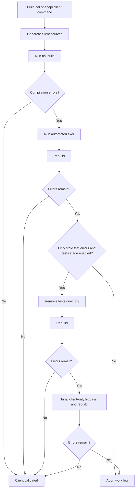

# Stage 2: Generate and Validate the Client

[← Stage 1](stage-1-sanitize-openapi-specification.md) · [OpenAPI workflow index](../openapi-workflow-reference.md) · [Next: Stage 3 →](stage-3-generate-tests.md)

## Purpose

Stage 2 generates Ballerina client sources from the aligned OpenAPI JSON and validates the complete project with
`bal build`. If compilation errors remain, it runs automated fixes and can remove stale tests that refer to an older
client surface before making a final recovery attempt.

## Relevant source

- [`openapi_workflow.bal`](../../connector-core/connector-automator/openapi_workflow.bal) implements build validation
  and stale-test recovery.
- [`client_generator`](../../connector-core/connector-automator/modules/client_generator/execute.bal) wraps the
  Ballerina OpenAPI client command.
- [`code_fixer.bal`](../../connector-core/connector-automator/modules/code_fixer/code_fixer.bal) implements iterative
  compilation-error repair.

## Contract

| Property | Contract |
|---|---|
| Workflow key | `client` |
| Input spec | `<spec-dir>/aligned_ballerina_openapi.json` |
| Project | Resolved `-o/--output`, already validated as a Ballerina build project |
| Generator | `bal openapi --mode client` |
| Options | License, tags, operation IDs, and resource/remote client method style |
| Validation | `bal build` plus parsed compilation diagnostics |
| Recovery | Up to three fixer iterations per `fixAllErrors` call, with an optional final pass |
| Failure policy | Unresolved compilation errors abort the workflow |
| Interactive target | Output project directory when another enabled stage follows |

## Control flow



## 1. Construct the client command

The base command is:

```bash
bal openapi -i <aligned-spec> --mode client -o <project> --client-methods <resource|remote>
```

The workflow maps CLI options as follows:

| CLI option | OpenAPI tool argument |
|---|---|
| `--license <path>` | `--license <resolved-path>` when the file exists |
| `-t/--tags <tag>` | Comma-separated `--tags` |
| `--operations <id>` | Comma-separated `--operations` |
| `--remote` | `--client-methods remote`; otherwise `resource` |

The command runs from the parent directory of the output project. A relative license path is resolved relative to that
working directory. A missing license file is silently omitted from the generated command.

## 2. Generate client sources

`executeClientGen` runs the command and reports parsed diagnostics in verbose mode when generation fails. At the
workflow boundary, generation failure is logged as a warning and validation continues. This allows an existing or
partially generated project to be evaluated and possibly repaired.

The OpenAPI tool normally writes `client.bal`, `types.bal`, and any supporting generated source into the flat output
project. The exact supporting file set is controlled by the installed Ballerina OpenAPI tool.

## 3. Build and run the first fix pass

The workflow runs `bal build` in the output project. When parsed compilation errors exist, it calls
`code_fixer:fixAllErrors(project, true)`. Auto-confirm mode permits fixes without interactive approval; the configured
maximum is three iterations. The workflow then rebuilds regardless of whether the fixer reports full or partial
success.

## 4. Isolate stale tests

If errors remain, the workflow checks whether every parsed error originates under `tests/`.

- When the tests stage is enabled, it attempts to remove the resolved Ballerina project's entire `tests` directory and
  rebuilds. Stage 3 will recreate it.
- When tests are excluded, or any remaining error belongs to client/non-test code, the stage aborts and recommends
  enabling test regeneration or fixing the errors manually.

Failure to remove the tests directory is logged only at verbose level; the subsequent build determines whether
recovery can continue.

## 5. Make the final recovery attempt

If the client-only rebuild still has compilation errors, the workflow calls the fixer once more, performs a final
build, and aborts if errors remain. A successful build records Stage 2 completion and optionally pauses for interactive
review.

## Artifacts and side effects

```text
<output-project>/
├── Ballerina.toml
├── client.bal
├── types.bal
├── <other OpenAPI-generated sources>
└── tests/                         # may be removed when stale
```

Fixer diagnostics and transient backups may be created during recovery and are cleaned on a best-effort basis by the
fixer.

## Running this stage

Generate and validate only the client from an existing aligned spec:

```bash
bal connector openapi -o ./connector --spec-dir ./connector \
    -x sanitize -x tests -x examples -x docs -v
```

Because sanitization is excluded, `./connector/docs/spec/aligned_ballerina_openapi.json` must already exist. Client
options such as `--remote`, `--license`, `--tags`, and `--operations` can be added to this command.

## Troubleshooting

| Symptom | Meaning | Maintainer or agent action |
|---|---|---|
| Client generation warns but build succeeds | Existing/partial sources still form a valid project | Inspect whether the intended operations were actually regenerated |
| License header is absent | The resolved license path did not exist | Use an absolute path or verify resolution relative to the output project's parent |
| Build fails only in tests | Tests target an older client surface | Run with Stage 3 enabled so stale tests can be removed and regenerated |
| Fixer reaches its iteration limit | Automated edits did not converge | Inspect fixer logs and remaining compiler diagnostics |
| Final build aborts the workflow | Client or retained tests still contain parsed compilation errors | Correct the generated code or adjust the source spec/options before rerunning |

## Implementation appendix: current limitations

- Client-generation failure is non-fatal until build validation, so stale generated sources can make the stage appear
  successful if they still compile.
- Build acceptance is based on parsed compilation errors rather than the command's success flag alone; a non-compilation
  build failure with no parsed diagnostics may not trigger recovery.
- A failed stale-test deletion is followed by another build and may be reported later as an unresolvable client build.
- Tags and operation filters affect the client surface and therefore also influence later tests, examples, and docs.
