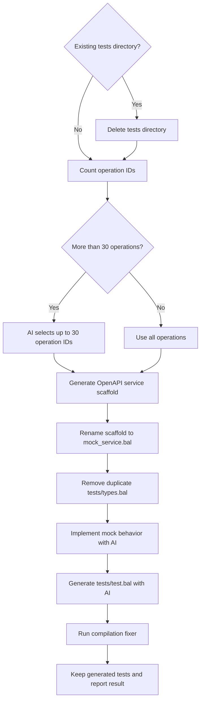

# Stage 3: Generate Tests

[← Stage 2](stage-2-generate-and-validate-client.md) · [OpenAPI workflow index](../openapi-workflow-reference.md) · [Next: Stage 4 →](stage-4-generate-examples.md)

## Purpose

Stage 3 replaces the connector's existing test suite with OpenAPI-derived tests. It generates a Ballerina service
scaffold as a local mock, asks the AI service to implement the mock behavior and test cases, and attempts to repair
compilation errors in the resulting project.

This reference covers the OpenAPI path through the shared `test_generator` module. The SDK workflow's live-test path
has a different contract and is out of scope.

## Relevant source

- [`openapi_workflow.bal`](../../connector-core/connector-automator/openapi_workflow.bal) deletes existing tests and
  applies the stage-level failure policy.
- [`test_generator/execute.bal`](../../connector-core/connector-automator/modules/test_generator/execute.bal) controls
  operation selection, mock generation, test generation, and repair.
- [`mock_service_generator.bal`](../../connector-core/connector-automator/modules/test_generator/mock_service_generator.bal)
  wraps OpenAPI service generation and normalizes its output.

## Contract

| Property | Contract |
|---|---|
| Workflow key | `tests` |
| Inputs | Generated connector project and aligned OpenAPI JSON |
| Existing tests | Entire resolved `tests/` directory is removed before generation |
| Operation limit | All operations up to 30; AI-selected subset when the count exceeds 30 |
| Primary outputs | `tests/mock_service.bal` and `tests/test.bal` |
| Cleanup failure | Fatal to the workflow |
| Generation failure | Warned by the workflow; later stages continue |
| Fixer failure | Warned inside the stage; generated files remain for manual review |
| Interactive target | `<output-dir>/tests/` when another enabled stage follows |

## Control flow



## 1. Replace the existing test directory

The workflow resolves the Ballerina project layout and checks `<ballerina-dir>/tests`. If present, it recursively
deletes the whole directory before calling the generator. This prevents old mock and test sources from leaking into
the regenerated suite.

Unlike test generation itself, deletion failure is fatal: the workflow returns immediately because it cannot safely
mix stale and newly generated files.

## 2. Choose the operation scope

The generator counts textual JSON occurrences of `operationId` in the aligned spec. For 30 or fewer operations, no
filter is passed and the full contract is used. Above 30, the AI service receives the extracted operation IDs and
selects a comma-separated subset of up to 30 representative operations.

The same selected list is passed to service-stub generation and test generation so the mock and tests target the same
surface.

## 3. Generate and normalize the mock scaffold

The stage runs one of these commands in the Ballerina project:

```bash
bal openapi -i <aligned-spec> --mode service -o <tests-dir>
bal openapi -i <aligned-spec> --mode service -o <tests-dir> --operations <id1,id2,...>
```

It expects `aligned_ballerina_openapi_service.bal`, renames it to `mock_service.bal`, and removes the generated
`tests/types.bal` so the mock uses the connector project's main `types.bal`. Missing expected output or file-operation
failure ends the generator call.

## 4. Implement mock behavior

The generated service scaffold and project `types.bal` are sent to the AI service. The returned Ballerina source has
surrounding code fences removed and replaces `tests/mock_service.bal`.

## 5. Generate the test file

The connector analyzer reads `Ballerina.toml`, client sources, types, and the completed mock. It optionally filters the
analyzed operations to the selected IDs, builds the test-generation prompt, strips code fences from the response, and
writes `tests/test.bal`.

## 6. Attempt compilation repair

The stage runs the shared fixer on the complete Ballerina project. Full success is logged. Partial fixes or a fixer
error produce warnings, but the stage retains the generated files for manual review. The workflow also treats an error
returned by `executeOpenApiTestGen` as non-fatal and continues to examples or documentation.

## Artifacts

```text
<ballerina-dir>/tests/
├── mock_service.bal
└── test.bal
```

Stage 5 may subsequently add `tests/README.md`. The temporary service `types.bal` is intentionally removed.

## Running this stage

Replace and regenerate only the tests for an existing client and aligned spec:

```bash
bal connector openapi -o ./connector --spec-dir ./connector \
    -x sanitize -x client -x examples -x docs -v
```

CLI preflight requires both `./connector/client.bal` and
`./connector/docs/spec/aligned_ballerina_openapi.json`. The existing tests directory is removed before replacement.

## Troubleshooting

| Symptom | Meaning | Maintainer or agent action |
|---|---|---|
| Existing tests cannot be removed | The stage cannot establish a clean output directory | Check permissions/locks; this error aborts the workflow |
| Expected service scaffold is missing | `bal openapi --mode service` returned success without the expected filename | Verify the installed OpenAPI tool version and output naming |
| Only a subset of operations is tested | The aligned spec has more than 30 operation IDs | Inspect verbose selection logs and the generated test coverage |
| Mock implementation fails | AI output could not be produced or written | Preserve the generated scaffold and implement/retry the mock manually |
| Tests are generated with compilation errors | The fixer was partial or failed | Run `bal test`/`bal build` and inspect `test.bal` and `mock_service.bal` |
| Later stages run after a test warning | Test generation is intentionally non-fatal at the workflow boundary | Treat pipeline completion as partial success until tests are verified |

## Implementation appendix: current limitations

- Operation counting uses a regex over JSON text rather than parsed OpenAPI operations.
- The AI-selected comma-separated operation list is trimmed but not validated for completeness, uniqueness, or
  membership before being passed to later steps.
- Existing tests are deleted before the replacement suite is known to be generatable; there is no rollback.
- Test-fixer errors do not fail the OpenAPI workflow, so generated tests may require manual repair.
