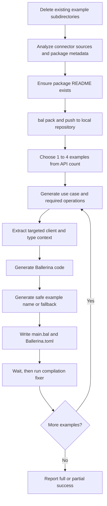

# Stage 4: Generate Examples

[← Stage 3](stage-3-generate-tests.md) · [OpenAPI workflow index](../openapi-workflow-reference.md) · [Next: Stage 5 →](stage-5-generate-documentation.md)

## Purpose

Stage 4 creates runnable Ballerina projects for AI-selected connector use cases. It analyzes the generated client,
publishes the connector package to the local Ballerina repository, chooses a number of examples from the API size,
generates each use case and its code, and attempts compilation repair.

Stage 4 creates example code, not example documentation. Stage 5 creates `examples/README.md` and each use-case
directory's generic `README.md`.

## Relevant source

- [`openapi_workflow.bal`](../../connector-core/connector-automator/openapi_workflow.bal) performs pre-generation
  cleanup and applies the stage-level failure policy.
- [`example_generator/execute.bal`](../../connector-core/connector-automator/modules/example_generator/execute.bal)
  implements the per-example loop and partial-success behavior.
- [`example_generator/analyzer.bal`](../../connector-core/connector-automator/modules/example_generator/analyzer.bal)
  analyzes the connector, writes projects, packs/pushes the connector, and invokes repair.

## Contract

| Property | Contract |
|---|---|
| Workflow key | `examples` |
| Connector input | Generated `client.bal`, `types.bal`, and `Ballerina.toml` |
| Output root | Resolved `--example-dir`, defaulting to `<cwd>/examples` in the current CLI |
| Cleanup | Existing child directories under the examples root are recursively removed |
| Example count | 1 for fewer than 15 APIs; 2 for 15–30; 3 for 31–60; 4 above 60 |
| Per-example output | `<example-name>/main.bal` and `<example-name>/Ballerina.toml` |
| Partial success | Individual use-case, code, name, write, and fixer failures do not stop other examples |
| Stage failure | Warned by the workflow; documentation can still run |
| Interactive target | Resolved examples directory when another enabled stage follows |

## Control flow



## 1. Clean existing example projects

Before generator execution, the workflow reads the resolved examples root and recursively removes every child
directory. Files directly under the root, such as an existing `README.md`, are retained. Read/remove errors are logged
but do not stop the workflow from attempting generation.

## 2. Analyze and publish the connector locally

The analyzer resolves flat or nested Ballerina layout, reads `client.bal`, `types.bal`, and `Ballerina.toml`, extracts
resource/remote signatures, and counts APIs. It also reads package organization, name, version, and distribution for
the generated example dependencies.

Examples depend on the connector through `repository = "local"`, so the stage first ensures a package README exists,
runs `bal pack`, and pushes with:

```bash
bal push --repository=local
```

If packing fails, the stage optionally repairs Java native interop, runs the Ballerina fixer, and retries packing once.
Pack or push failure ends example generation and is downgraded to a workflow warning.

## 3. Choose the number of examples

| Detected API operations | Requested examples |
|---:|---:|
| 0–14 | 1 |
| 15–30 | 2 |
| 31–60 | 3 |
| 61 or more | 4 |

The count includes resource and remote isolated functions found in `client.bal`.

## 4. Generate each use case

For every requested example, the AI service selects a use case and required connector functions while receiving the
previously used function names to reduce repetition. The analyzer then extracts the initializer, matching operation
signatures, directly referenced types, and essential nested types to a maximum dependency depth of two.

Use-case selection, invalid function lists, context extraction, and code-generation failures skip only the current
example.

## 5. Name and write the example project

The AI service proposes the directory name. If name generation fails, the fallback is `example_<number>`. Names
containing `..`, `/`, or `\` are rejected. The directory name is separately normalized into a valid package name for
`Ballerina.toml`.

Each successful write produces:

```text
<examples-dir>/<example-name>/
├── Ballerina.toml
└── main.bal
```

The manifest declares a local-repository dependency on the generated connector and inherits its Ballerina
distribution. Stage 4 does not create `README.md` in the use-case directory.

## 6. Repair and report partial success

After writing an example, the stage waits ten seconds and runs the shared compilation fixer in that example project.
Fix failure is a warning and the example is still counted as generated because its files were written. Failures before
the write are skipped and reduce the final success count.

The generator returns normally even when fewer than the requested examples succeeded; it logs the ratio. Only setup
errors that escape the per-example loop return an error to the workflow.

## Running this stage

Regenerate only examples from an existing connector:

```bash
bal connector openapi -o ./connector --spec-dir ./connector --example-dir ./connector/examples \
    -x sanitize -x client -x tests -x docs -v
```

Although Stage 4 does not read the aligned spec directly, current CLI preflight still requires it when `sanitize` is
excluded. Passing `--example-dir ./connector/examples` also keeps Stage 5's later discovery path consistent.

## Troubleshooting

| Symptom | Meaning | Maintainer or agent action |
|---|---|---|
| Old example directories disappeared | Cleanup runs before generation | Recover from version control and avoid rerunning against irreplaceable output |
| Root examples README remains stale | Cleanup removes directories, not root files | Run Stage 5 or remove/regenerate the root README |
| Pack retry fails | Connector sources or native interop remain invalid | Build and pack the connector manually before rerunning examples |
| Fewer examples than expected | One or more per-example steps were skipped | Inspect verbose warnings for the failing iteration |
| Example exists but does not compile | Fix failure is non-fatal after files are written | Run `bal build` in that example and repair it manually |
| Example docs are missing | READMEs are created by Stage 5 | Enable `docs` and ensure examples are in the discoverable location |

## Implementation appendix: current limitations

- The CLI currently defaults `--example-dir` to `<cwd>/examples`, while Stage 5 discovers examples only at
  `<output-project>/examples`; these paths differ when the output project is elsewhere.
- Cleanup errors are logged but not returned, so stale and new example directories can coexist after partial cleanup.
- A temporary generic connector `README.md` may be created solely to satisfy `bal pack`; Stage 5 may later replace it.
- The fixed ten-second delay applies after every written example regardless of whether the package repository needs
  propagation time.
- Example fixer failure still increments the successful-generation count.
