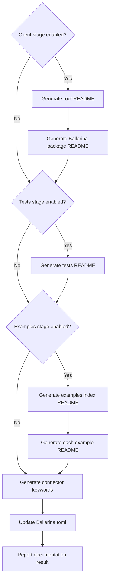

# Stage 5: Generate Documentation

[← Stage 4](stage-4-generate-examples.md) · [OpenAPI workflow index](../openapi-workflow-reference.md)

## Purpose

Stage 5 analyzes the generated connector, tests, and examples; combines deterministic Markdown templates with
AI-generated sections; writes README files; and adds connector catalog keywords to `Ballerina.toml`.

Generation respects upstream stage exclusions so it does not require artifacts the user deliberately skipped.

## Relevant source

- [`openapi_workflow.bal`](../../connector-core/connector-automator/openapi_workflow.bal) invokes documentation and
  treats failure as non-fatal.
- [`document_generator/execute.bal`](../../connector-core/connector-automator/modules/document_generator/execute.bal)
  selects outputs according to excluded stages.
- [`document_generator/ai_generator.bal`](../../connector-core/connector-automator/modules/document_generator/ai_generator.bal)
  analyzes content, fills templates, writes READMEs, and updates keywords.

## Contract

| Property | Contract |
|---|---|
| Workflow key | `docs` |
| Inputs | Connector project plus non-excluded tests and examples |
| Client docs | Root and resolved Ballerina-project `README.md` when `client` is enabled |
| Test docs | `<ballerina-dir>/tests/README.md` when `tests` is enabled |
| Example docs | `<connector>/examples/README.md` and `<example>/README.md` when `examples` is enabled |
| Metadata | Adds/replaces `[package].keywords` in `Ballerina.toml` |
| Naming | Every individual use-case document is the generic `README.md` |
| Failure policy | First propagated error stops this stage; workflow warns and completes |
| Interactive review | None; documentation is the final stage |

## Control flow



## 1. Analyze connector metadata

The generator resolves the Ballerina project, reads its package metadata and generated sources, and discovers example
directories under `<connectorPath>/examples`. This metadata supplies connector name, version, API context, example
names, and source material for prompts and templates.

## 2. Generate client documentation

When `client` was not excluded, `executeDocumentGeneration` calls `generateMainReadme` followed by
`generateBallerinaReadme`.

- The main README combines generated header/badges, getting-started content, useful links, and connector metadata.
- The Ballerina package README contains overview, setup, quickstart, and examples sections.

Templates are embedded in the Ballerina module. Every placeholder is replaced, including optional values that become
empty strings, so raw `{{PLACEHOLDER}}` tokens do not remain in output.

## 3. Generate test documentation

When `tests` was not excluded, the stage writes `<ballerina-dir>/tests/README.md` from analyzed connector metadata and
AI-generated testing guidance. The parent directory is created if needed.

## 4. Generate example documentation

When `examples` was not excluded, the stage first writes `<connectorPath>/examples/README.md`, which lists discovered
use-case directories. It then scans every non-hidden child directory, reads its `.bal` files, generates a self-contained
guide, and writes:

```text
<connectorPath>/examples/<example-directory>/README.md
```

Individual example failures are logged and skipped so other example READMEs can still be produced. The filename is
always `README.md`, not a name derived from the example directory.

## 5. Normalize generated Markdown

Before writing, the generator normalizes AI/template output. This cleanup is shared by root, package, test, and example
README generation and is intended to remove common duplicated or malformed Markdown produced during composition.

## 6. Generate connector keywords

Metadata generation runs unless the internal exclusion list contains `metadata`. The public OpenAPI exclusion set does
not expose that value, so normal Stage 5 execution always attempts it.

The generated keyword list contains:

```text
Name/<Display Name>, <cost>, <vendor>, <area>, Type/Connector
```

The writer replaces an existing `keywords` value inside `[package]`, including a multiline array, or inserts the new
value after the package `version`. It checks the flat project first and then the nested SDK layout.

## Artifacts and mutations

```text
<connectorPath>/
├── README.md
├── Ballerina.toml                 # [package].keywords updated
├── tests/
│   └── README.md
└── examples/
    ├── README.md
    └── <example-name>/
        └── README.md
```

For a nested SDK layout the package and test READMEs live under `ballerina/`. This OpenAPI workflow normally uses a
flat project.

## Exclusion behavior

| Excluded stage | Documentation skipped |
|---|---|
| `client` | Root/main and Ballerina package README generation |
| `tests` | Tests README generation |
| `examples` | Examples index and individual example READMEs |
| `docs` | Entire Stage 5 |

Metadata keywords are still attempted when Stage 5 runs.

## Running this stage

Documentation is normally generated at the end of a full run:

```bash
bal connector openapi -i ./openapi.json -o ./connector \
    --spec-dir ./connector --example-dir ./connector/examples
```

Exclusions are also documentation inputs. A command that excludes `client`, `tests`, and `examples` to leave only
Stage 5 enabled will skip all corresponding READMEs and attempt only metadata keywords. There is currently no Java CLI
mode that skips an upstream stage while asking Stage 5 to regenerate that stage's documentation anyway.

## Troubleshooting

| Symptom | Meaning | Maintainer or agent action |
|---|---|---|
| Root README contains package content instead of repository content | Flat layout mapped two generators to the same path | Decide which form is desired and regenerate/edit after addressing the collision |
| Individual example README is missing | Its generation failed or the directory was not discovered | Check verbose warnings and confirm it is under `<connectorPath>/examples` |
| Examples exist in a custom directory but docs do not list them | Documentation ignores `--example-dir` and scans the connector path | Copy/link examples under the connector or correct path plumbing |
| Test README describes the wrong testing model | The current prompt is shared/biased toward live-only tests | Reconcile the generated text with Stage 3's mock-based OpenAPI tests |
| Keywords are missing | Metadata analysis/generation failed or no Ballerina.toml was found | Check package name, model output, and the resolved project layout |
| Workflow completes after a documentation warning | Stage 5 failure is non-fatal | Treat docs as incomplete and rerun after fixing the first failing generator |

## Implementation appendix: current limitations

- In the flat OpenAPI layout, `generateMainReadme` and `generateBallerinaReadme` both target
  `<connectorPath>/README.md`; the second call overwrites the first.
- The tests README prompt currently requests live-only guidance and fixed credential examples even though the OpenAPI
  test stage generates a mock service and mock-backed tests.
- Example discovery is hard-coded to `<connectorPath>/examples` and does not receive the resolved `--example-dir`.
- Most generation functions propagate errors with `check`, so the first client/test/examples/metadata failure stops
  the remainder of Stage 5. Individual example README failures are the notable per-item exception.
- Documentation failure is downgraded to a warning by the workflow, and there is no interactive pause after the final
  stage.
